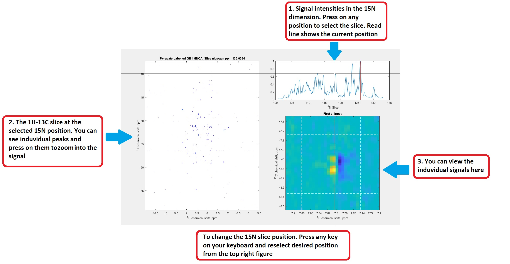

## 8. Import and Visualize 3D HNCA NMR   

In this example 3D NMR experiments have been introduced and we discuss how they can be used to study large biomolecular structures. This is especially important in the analysis of large proteins which contain many amino acids, whose signals in standard 1D and 2D experiments would cause crowding and overlap. The extension of the experiment into the third dimension allows one to encode more information. In this tutorial the HNCA spectra was imported and its use in  protein backbone assignment briefly outlined. 
Visualisation of 3D spectra can be difficult. We have shown how this can be roughly done with three dimensional surface plots. However, more commonly 2D slices at particular dimensions are extracted and analysed as if a 2D spectra. 
This NMR data is kindly provided by Prof. Ilya Kuprov, University of Southampton.  

### Usage

This code can be opened in [MATLAB® Online™](https://matlab.mathworks.com/).

